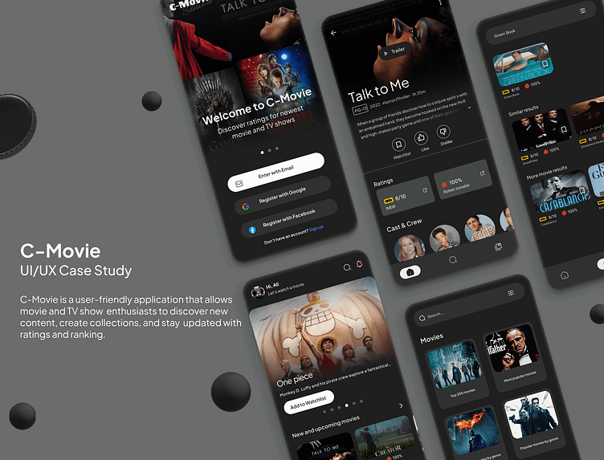

This is a new [**React Native**](https://reactnative.dev) project, bootstrapped using [`@react-native-community/cli`](https://github.com/react-native-community/cli).

# Getting Started

## Step 1: Start the Metro Server

First, you will need to start **Metro**, the JavaScript _bundler_ that ships _with_ React Native.

To start Metro, run the following command from the _root_ of your React Native project:

```bash
# using npm
npm start

# OR using Yarn
yarn start
```

## Step 2: Start your Application

Let Metro Bundler run in its _own_ terminal. Open a _new_ terminal from the _root_ of your React Native project. Run the following command to start your _Android_ or _iOS_ app:

### For Android

```bash
# using npm
npm run android

# OR using Yarn
yarn android
```

### For iOS

```bash
# using npm
npm run ios

# OR using Yarn
yarn ios
```

// TODO:IN PROGRESS:

- use redux with search
- add profile and home user collections "favorites, collections, gmail"
- fix text alignment with arabic
- fix landscape mode
- use app responsive size "in progress"

// HIGH PRIORITY:
- add social login
- introduce welcome screen
- find a way to set i18n language correctly 'from user firestore'
- fix lag with arabic "deffered"

// LOWER PRIORITY:
- create firebase user type
- add home screen trailer section
- fix native device theme switch not working
- sync static day for trending movies
- search custom suggestions screen
- find fix for theme with navigation "works without bottom tabs borders"
- add render views component for a dynamic home page